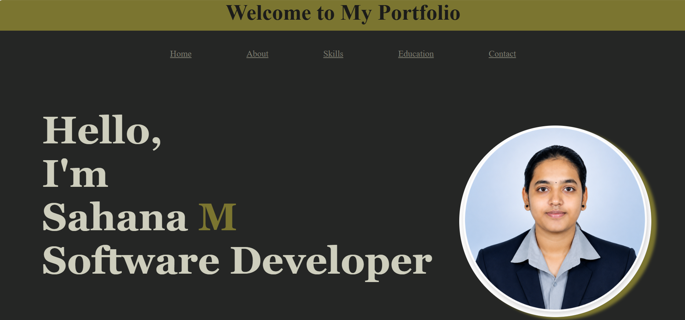

Sahana Portfolio Website

A personal portfolio website that showcases my skills, education, projects, internship experience, and contact information.

🚀 Features

- Home section
- About Me section
- Skills section
- Education section
- Projects section
- Internship experience
- Contact form
- Responsive design
- JavaScript notifications and interactions

🛠️ Technologies Used

- HTML5
- CSS3
- JavaScript
- React.js

📂 Project Sections

Home

Introduction and a short overview of my profile.

About Me

Information about my education, interests, and career goal.

Skills

- HTML
- CSS
- JavaScript
- React.js
- Node.js
- Express.js
- SQL
- Python
- Git & GitHub

Projects

A collection of my academic and personal projects.

Contact

A contact form through which visitors can send a message.

💻 How to Run

1. Clone this repository.
2. Open the project folder in VS Code.
3. Install the required dependencies if it is a React project.
4. Run the application.
5. Open it in your browser.

📸 Screenshot
    ![Sahana Portfolio]
    

🔗 Links

- GitHub: https://github.com/sahana123
- View My Portfolio: https://sahana0258.github.io/My-Portfolio/
- LinkedIn: https://www.linkedin.com/in/sahana-m-1b6526316
👩‍💻 Author

Sahana M
Aspiring Full Stack Developer passionate about building user-friendly web applications.